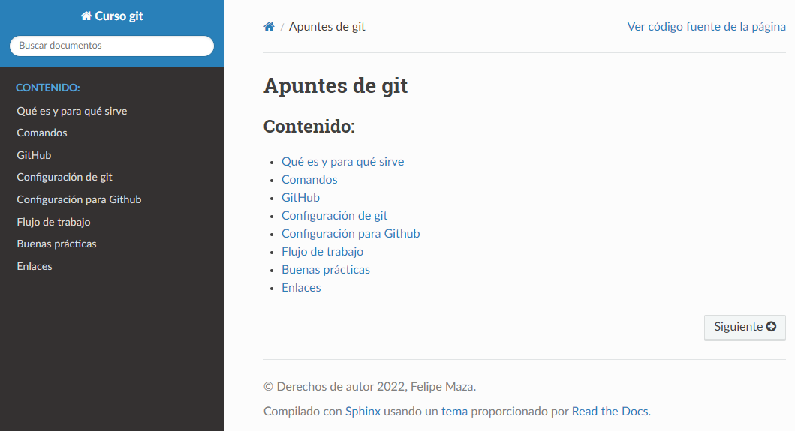

# Apuntes Git

Documentación que describe cómo utilizar git y buenas prácticas que realizamos.  

## Cómo acceder

La documentación está accesible a través de la URL: [https://ihcantabria.github.io/ApuntesGit/](https://ihcantabria.github.io/ApuntesGit/).

## Contacto

La documentación está mantenida por [Felipe Maza](https://ihcantabria.com/directorio-personal/tecnologo/felipe-maza-fernandez/).