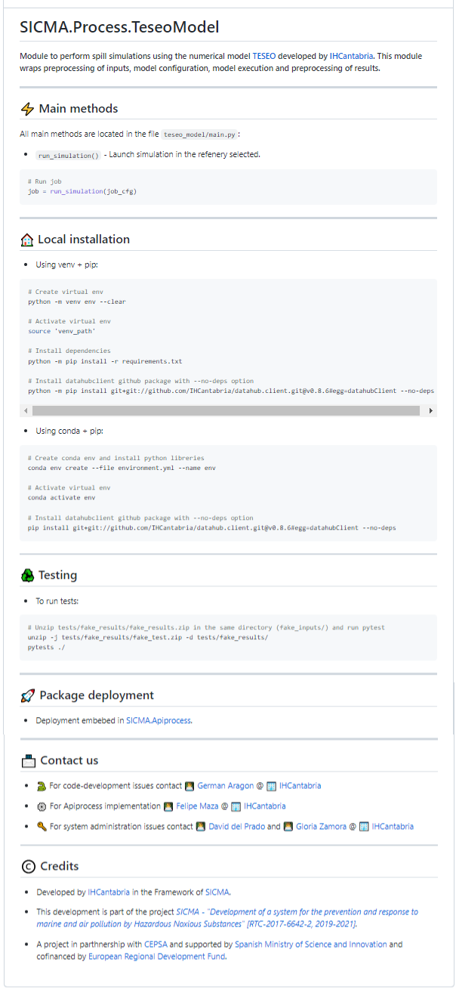
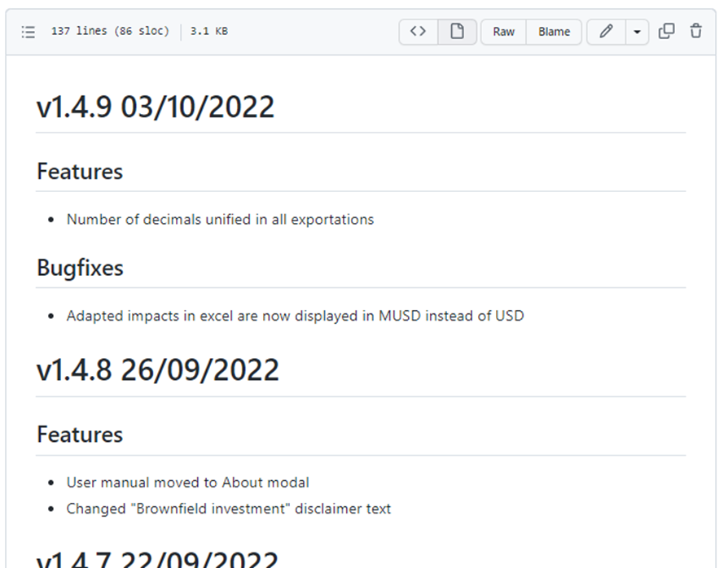
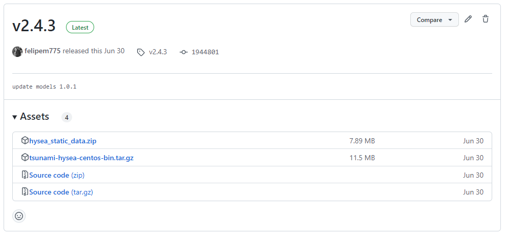

# Buenas prácticas

## README.md

El fichero `README.md` colocado en la raíz del proyecto es el fichero que todos consultan primeramente cuando visitan un proyecto, y en GitHub además hacer una preview del él cuando visitamos un proyecto.

En él debemos añadir siempre una serie de apartados que serán muy útiles:

- Descripción
- Cómo instalarlo
- Cómo usarlo
- Contacto
- Licencia

Cualquier información relevante, nunca está de más.

## Changelog.md

En el changelog vamos resumiendo los avances que se realizan en cada versión que se etiqueta.  
Aunque la información podría consultarse en el `log`, aquí encontraremos un resumen fácil de leer y enumerando simplemente las nuevas funcionalidad o correcciones de cada versión.  
Si usamos trello o planner, normalmente aquí enumeramos el título de las tarjetas realizadas.

## .gitignore

El fichero `.gitignore` incluye patrones de los nombres de fichero que no queremos que se añadan al repositorio, como pueden ser ficheros que generan los compiladores o archivos temporales. En [este repositorio](https://github.com/github/gitignore) podemos encontrar plantillas de ficheros por lenguaje.  
Además, debemos añadir al listado nuestros ficheros de configuración personal, por ejemplo visual code genera una carpeta llamada `.vscode`, esta configuración que usamos para nosotros crearía conflictos con la configuración de otros compañeros.

## Subir ficheros binarios

Para compartir ficheros binarios, como pueden ser datos de input del modelo, en lugar de añadirlos al repositorio como si fuera código fuente, debemos adjuntarlos (podemos juntarlos en un zip) cuando publicamos una nueva release.

Los pasos son:

- Etiquetar la versión del proyecto
- En la web del proyecto, vamos a la sección de tags (https://github.com/IHCantabria/NombreDelProyecto/tags)
- Selecionamos el tag y en las opciones disponibles está _Create release_.
- Asignamos como nombre de release el mismo que tiene como tag, una descripción y debajo de esa caja de texto tendremos la opción de adjuntar binarios.
- En el README, donde explicamos cómo instalar y usar el proyecto, especificaremos qué deben hacer con esos ficheros.

Nota: Cuando lancemos una nueva release, deberemos adjuntar de nuevo los ficheros.

En la siguiente ventana vemos cómo para una versión disponemos del código fuente -en formato zip y tar.gz-, y otros dos ficheros que son los binarios que hemos adjuntado.

## Otras buenas prácticas

- `Commits` deben tener un objetivo específico. Evitar resolver dos problemas en el mismo `commit`.
- Mensajes de `commit` concisos
- No añadir binarios al repositorio, especialmente de gran tamaño (vídeos, PDFs).
- Evitar subir datos sensibles como contraseñas.
- Evitar reescribir la historia, antes o después nos dará algún disgusto.
- Añadir en trello/planner la versión que hemos etiquetado en la tarjeta de despliegue o publicación.
