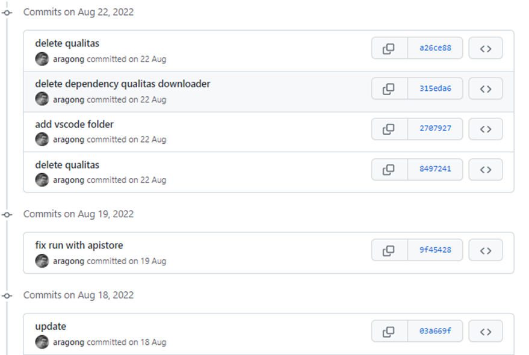

# Comandos

Git trabaja como un sistema distribuido, podemos trabajar contra nuestro repositorio sin conectarnos remotamente a GitHub.

## `init`

Iniciamos un nuevo repositorio local. Genera una carpeta oculta llamada `.git`, que contiene toda la información necesaria para trabajar.

## `clone`

El método `clone` descarga un repositorio en nuestro equipo. Contiene todo el histórico y referencias hacia el repositorio remoto.

## `add` & `commit`

El guardado se realiza en dos pasos, primero debemos especificar cuáles son los ficheros que nos interesan, con `add` los pasaremos a estado `staged`, posteriormente con `commit` confirmamos que queremos grabar esos ficheros, y especificaremos un mensaje.

## `diff`

Muestra todas las líneas que han cambiado respecto al commit o tag que le pasemos como parámetro.
Veremos cómo era la línea antigua y cómo es la actual.

## `fetch`

Para traernos los cambios del repositorio remoto, pero a diferencia de `pull`, en este caso no hará el `merge` de los ficheros, que será un paso que tengamos que realizar nosotros.

## `branch`

Crea una nueva rama a partir de la actual. Es un nuevo lugar de trabajo. En las ramas haremos los cambios que nos llevaremos a la rama principal main.

## `checkout`

Cambia la rama activa a la que decidamos o incluso a un commit o tag.

## `merge`

Trae los cambios de una rama que especiquemos a la actual, combinando los cambios. Cuando terminemos de realizar los cambios en la rama de desarrollo, iremos a main y desde esa haremos el merge de la rama donde hicimos los avances.

## `pull` / `push`

Para traernos los cambios del repositorio remoto, utilizamos el comando `pull`. Descargará la rama especificada y hara un `merge` de los ficheros, las historias de local y remoto quedarán igualadas.
Cuando queremos enviar las novedades de nuestro repositorio al remoto, utilizaremos el comando `push`.

## `tag`

Etiqueta un commit con un nombre que decidamos. Le da mayor relevancia y le podemos asignar un nombre, normalmente el número de versión.

## `log`

Muestra el listado de commits y su información: autor, fecha y mensaje. Muy útil no solo para saber qué cambios ha hecho nuestro compañero sino también cuáles fueron los últimos cambios que hicimos en un proyecto que retomamos.

