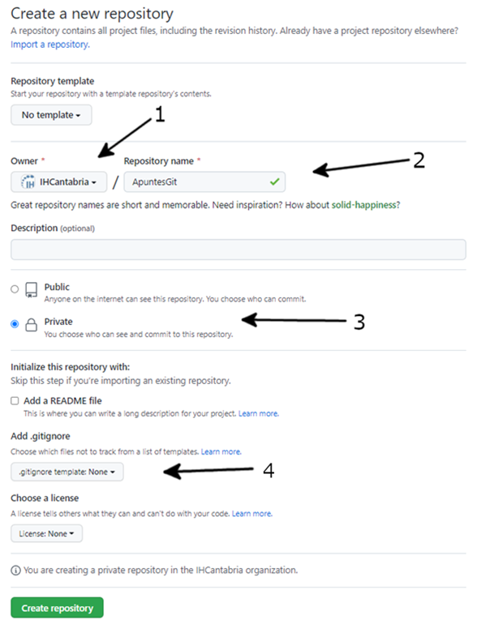
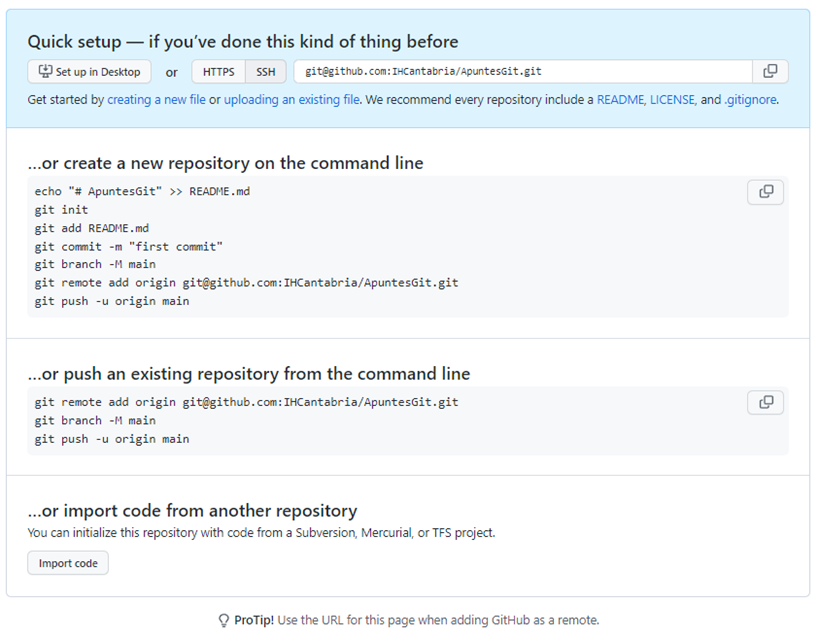
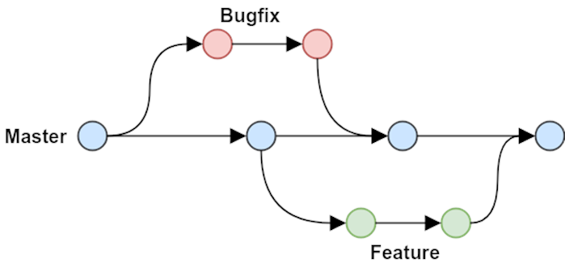

# Flujo de trabajo

## Crear un nuevo repositorio

Para añadir un nuevo repositorio, desde la web de GitHub, en la esquina superior derecha, disponemos de un botón para crear nuevo repositorio.

En el formulario deberemos modificar los siguientes parámetros:

1. Propietario IHCantabria
2. Nombre proyecto, CamelCase.Tipo
3. Visibilidad del repositorio
4. Plantilla de .gitignore

Tras ello, en la siguiente pantalla veremos las instrucciones para:

- En caso de que no existiera el repositorio.
- En caso de que ya tuviéramos un repositorio en nuestro equipo, cómo vincularlo.

## Trabajando con ramas

A la hora de trabajar en el repositorio, utilizamos siempre ramas, no trabajamos directamente sobre la rama principal, ésta debe tener el código listo para producción.

Así pues, los pasos a realizar:

- Creamos el `branch` desde la rama principal.
- El nombre del `branch` debe ser corto y descriptivo.
- Una vez unido los cambios a main, eliminar el `branch`.
- Solo desplegamos versiones etiquetadas.
