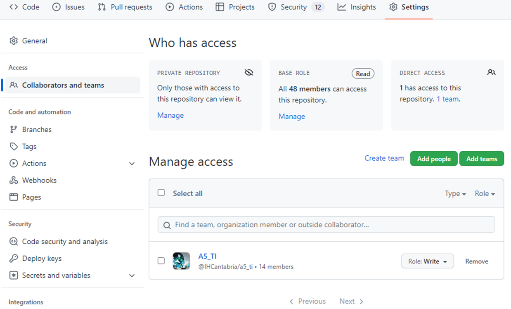
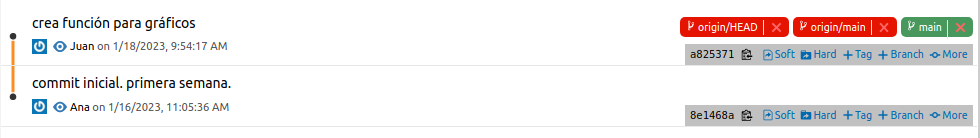
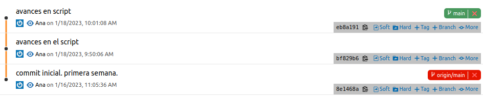
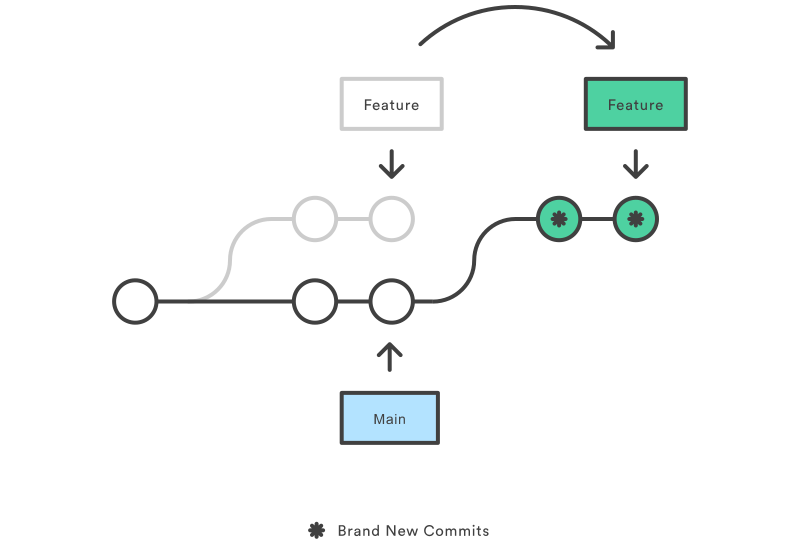
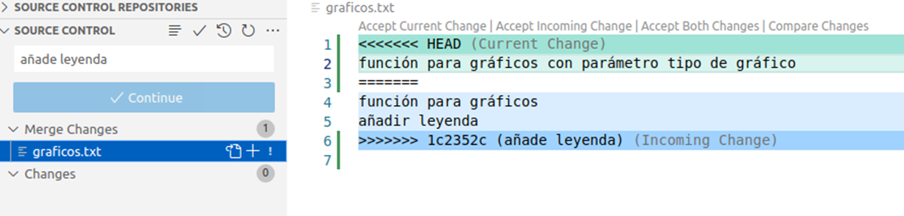
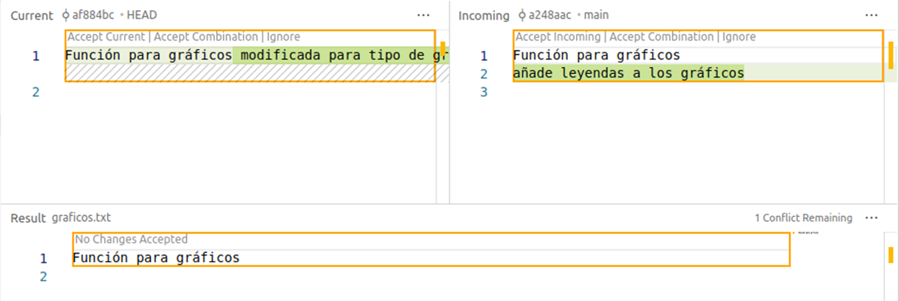

# Trabajo en equipo

Cuando trabajamos en un repositorio con más gente nos podemos encontrar ciertos conflictos con el código subido al repositorio remoto.

A través de unos ejemplos vamos a ver las situaciones que se pueden dar cuando trabajamos en equipo:

- Trabajan con diferentes ficheros, por lo cual es fácil resolver los conflictos.
- Trabajan modificando ficheros en común, hay que resolver manualmente los conflictos.

## Dar permisos en GitHub

Por defecto, cuando hagamos un repositorio en GitHub todos los usuarios de la organización tendrán derechos de lectura pero no de escritura. Desde `Settings` del proyecto, `Collaborations and teams` podremos añadir tanto grupos completos o personas que no tienen por qué pertenecer a nuestra organización con derechos de escritura o superiores.

## Caso de ejemplo

Tenemos a dos desarrolladores que llamaremos *Ana*  y *Juan* que van a programar un operacional. Cada semana se les asignarán ciertas tareas:

### Semana 1

- Ana
  - Crea la carpeta del proyecto con los ficheros iniciales (`README.md`, `.gitignore`, etc.).
  - Inicializa el repositorio y lo sube a github (`init` & `remote add origin url`).
  - Desarrolla script para ejecución del operacional. Guarda cambios (`commit`).
  - Subir cambios al repositorio (`push -u origin master`).

En este caso no hay conflictos, *Ana*  ha trabajado de manera individual.

### Semana 2

- Ana
  - Continúa con el script de ejecución.
  - Guarda los cambios varias veces a la semana (`commit`).
  - El viernes sube los datos al repositorio (`push`).

- Juan
  - Descarga el repositorio (`clone`).
  - Desarrolla módulo para gráficos.
  - Guarda los datos el miércoles (`commit`) y lo sube (`push`).

En este caso, *Ana* va a recibir un mensaje de error cuando intente realizar el `push`.

Como podemos ver, en la historia ambos parten de un commit (`8e1468a`) pero luego cada uno tiene sus propios commits.  
Cuando *Ana* intenta subir sus cambios, el repositorio remoto tiene el `commit` de Juan y no sabe cómo introducir los nuevos cambios, pues no existe una continuidad en los `commit`.

La solución es descargarse los cambios a un `branch` e introducirlo en su historia. Para ello usaremos los siguientes comandos:

- `git fetch` para descargar los ficheros, quedarán en un `branch` llamado `origin/main`.
- `git rebase origin/main` para aplanar los commits.

Rebase tomará los commits del branch y los colocará tras el commit en común, a continuación modificará los commits nuestros para que sean a partir del nuevo `commit`. Ahora ya podrá subir los datos con `push` pues los nuevos commits son a partir de los que ya existen en el repositorio.

### Semana 3

- Ana
  - Comprueba que no haya novedades en GitHub (`pull`).
  - Más avances en el script
  - Añade leyenda en las gráficas.
  - Guarda los datos entre semana y el viernes sube los datos al repositorio (`push`).

- Juan
  - Actualiza el repositorio (`pull`).
  - Nuevo módulo para informes.
  - Modifica las gráficas para disponer de más tipo de gráfico.
  - Guarda los datos el miércoles (`commit`) y lo sube (`push`).

Al igual que en la seman anterior, *Ana* encontrará problemas para subir sus cambios por el mismo motivo.

En este caso, tras el `git fetch`, el `git rebase` no tendrá éxito porque hay un fichero en común que se modifica por lo que el usuario deberá especificar qué cambios deben quedar, si los de *Juan* (`Current Change`) o los de *Ana* (`Incoming Change`), o bien ambos o un nuevo código.

Herramientas visuales ayudan mucho a hacer este trabajo, pues desde un editor de texto sin mejoras es bastante farragoso. VSCode incluye algunas visualizaciones que nos ayudarán mucho:

Una vez guardado el fichero final, añadiremos un mensaje y ya podremos subir los cambios al repositorio remoto.
