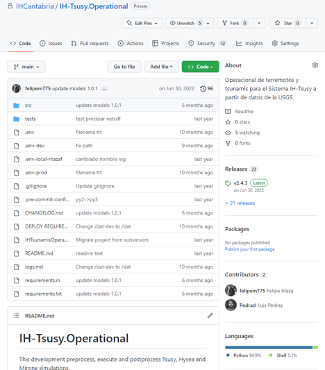

# Versionado semántico

Etiquetar versiones es muy importante, pues a la hora de distribuir nuestro código debería ser siempre en versiones concretas.

Existen diferentes formas de etiquetar, en el IH seguimos el llamado versionado semántico, que tiene publicada la especificación en la siguiente web:

[https://semver.org/](https://semver.org/)

En resumen:

La versión se compone de 3 cifras separadas por `.`. Por ej. `2.18.3`.

El primer número se denomina `MAYOR`, el segundo `MENOR` y el tercero `PARCHE`. Cuando uno de ellos se incrementa, los de la derecha pasan a `0`.

Aumentamos la versión `MAYOR` cuando se realiza un cambio incompatible en el API. Esto es, cuando al actualizar el software tenemos que realizar cambios en la forma de invocarlo o en llamadas que realizamos.  
Aumentamos la versión `MENOR` cuando se añaden nuevas funcionalidades y el resto del código sigue siendo compatible con la versión anterior.  
Aumentamos la versión `PATCH` cuando reparamos algún bug y continua la compatibilidad con la versión anterior. Aquí también incluimos cambios en textos, colores, etc.

Según la especificación, la versión puede llevar como sufijo algunas palabras como `ALPHA`, `BETA`, `RC`, pero nosotros no solemos utilizarlas.

## Ejemplos

Para practicar algunos ejemplos: *Ana* y *Juan* llevan meses trabajando en el operacional, han lanzado la versión `2.18.3`.

Las siguientes tareas -con sus versiones- que realizarán son:

- Nueva fuente de datos al operacional.
- Cambian los colores de las gráficas.
- Permiten al usuario elegir los colores y corrigen el valor el color “rojo”.
- Cambian textos en leyenda y renombran funciones del script de ejecución.
- Admiten nuevo formato de datos si el usuario usa el parámetro `--input-format=`

Soluciones:

- *Nueva fuente de datos al operacional*. Se trata de una funcionalidad por lo que es un cambio `MENOR`, la nueva versión se etiqueta como `2.19.0`.
- *Cambian los colores de las gráficas*. Se trata de cambios que no afectan al funcionamiento, por lo tanto entra en la categoría de `PATCH`, `2.19.1`.
- *Permiten al usuario elegir los colores y corrigen el valor el color “rojo”*. Se trata de dos cambios pero solo se etiqueta una vez, por tanto tomamos el cambio de mayor importancia, en este caso el permitir al usuario elegir colores es una nueva funcionalidad (`MENOR`) es más importante que corregir un valor (`PATCH`), `2.20.0`
- *Cambian textos en leyenda y renombran funciones del script de ejecución*. Aquí también tenemos dos funcionalidades. Renombrar funciones del script provoca que no funcione con versiones anteriores por lo que es un cambio `MAYOR`. `3.0.0`
- *Admiten nuevo formato de datos si el usuario usa el parámetro `--input-format=`*. Aquí también modificamos el API pero éste sigue siendo compatible con el anterior, por lo que se trata de `MENOR`. `3.1.0`.

## Etiquetar desde GitHub

Desde el cliente de git podemos crear tags y subirlos con `git push --tags`, pero desde la interfaz de GitHub podemos trabajar con el concepto de `Releases`, que no es propio de git sino que es un etiquetado vitaminado, ya que permite añadirle más información y adjuntar ficheros.

Desde la página del proyecto, en la parte derecha disponemos de información sobre las Releases y una vez en la sección podemos crear una nueva release que a su vez genera un `tag` si lo creamos desde el `branch`.

